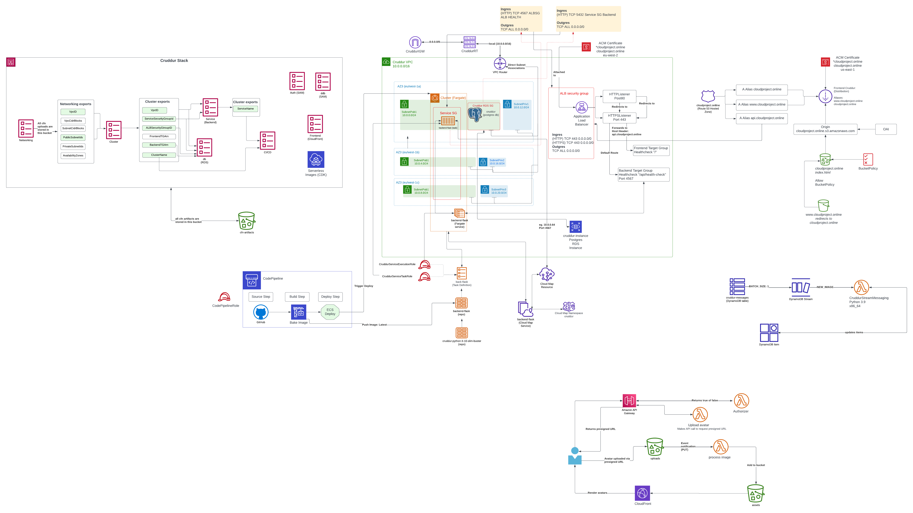

# FREE AWS Cloud Project Bootcamp

This application has been created while taking part in the free AWS Cloud project bootcamp by Andrew Brown / ExamPro. The starting code base [ExamPro AWS Cloud Project Bootcamp](https://github.com/ExamProCo/aws-bootcamp-cruddur-2023) has been used as a template to initially create this project. The bootcamp ran over four months during which new code was regularly committed to this repository accompanied by journal entries describing the weekly progress.

## Structure of the project

The project consists of a social media application called 'Cruddur'. The users are able to message each other and they have a feed that displays messages that are relevant to them. The frontend of the project has been created with ReactJS (JavaScript). The backend has been created with Flask (Python). The project also includes a large number of bash scripts. Additionally, Ruby has been used for a few small parts of the project.

Parts of the application itself were ready when the bootcamp started, but a large part of it was completed during the bootcamp. Additionally, existing parts were modified as needed while progressing through the bootcamp. However, the main focus of the bootcamp was to deploy the application on AWS.

# Architecture

The architecture of the project is described in the below diagram:

Each part of the diagram is explained in detail in the journal. Most parts are described in the week 10-11 journal, apart from 'Serverless Image processing' which is explained in the week 8 journal, due to it not yet being incorporated into CloudFormation.

## AWS services that were used

The application has been deployed on AWS by utilizing several AWS services. The backend has been deployed as a **Docker** container on **ECS Fargate**.

Frontend has been deployed using **S3** and  **CloudFront**.

**X-Ray** is instrumented to be used as an observability tool. 

**Cognito** is used for decentralized authentication.

**RDS Postgres** is used as a database for the user data. **DynamoDB** is used as a single table design for the messages.

A hosted zone on **Route 53** is linked to the custom domain cloudproject.online. **Application load balancer** is used to forward requests to the frontend and backend containers.  

Serverless image processing is implemented using **API Gateway**, two **Lambda** functions, **presigned URL**, **S3** and **CloudFront**.

**CodePipeline**, **CodeBuild** and **CodeDeploy** are used for CI/CD.

The first version of the project was completed by partially clicking through the AWS console and utilising AWS CLI. During weeks 10-11, the infrastructure was re-created using **CloudFormation**. Additionally to CloudFormation, the serverless image processing (week 8) was completed with **AWS CDK**.  

## Third-party tools that were used

**Honeycomb** was used as an observability tool as an addition to AWS X-Ray mainly because it was very straightforward to instrument and easy to use.

**Rollbar** was configured to be used for monitoring and bug-tracking.

## Weekly journal

I have written a detailed journal for each week of the project. I have added architectural diagrams to several weekly journals in order to clarify the infrastructure that was created during that week. The journal entries contain details of the steps that were completed during the week and information about overcoming possible challenges. Some of the weekly journal entries also contain links to articles I have written about some aspects of that specific week. 

- [ ] [Week 0](journal/week0.md)
- [ ] [Week 1](journal/week1.md)
- [ ] [Week 2](journal/week2.md)
- [ ] [Week 3](journal/week3.md)
- [ ] [Week 4](journal/week4.md)
- [ ] [Week 5](journal/week5.md)
- [ ] [Week 6](journal/week6.md)
- [ ] [Week 7](journal/week7.md)
- [ ] [Week 8](journal/week8.md)
- [ ] [Week 9](journal/week9.md)
- [ ] [Week 10](journal/week10.md)
- [ ] [Week 11](journal/week11.md)
- [ ] [Week 12](journal/week12.md)
- [ ] [Week 13](journal/week13.md)
