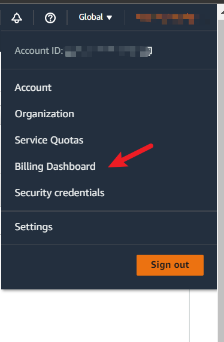
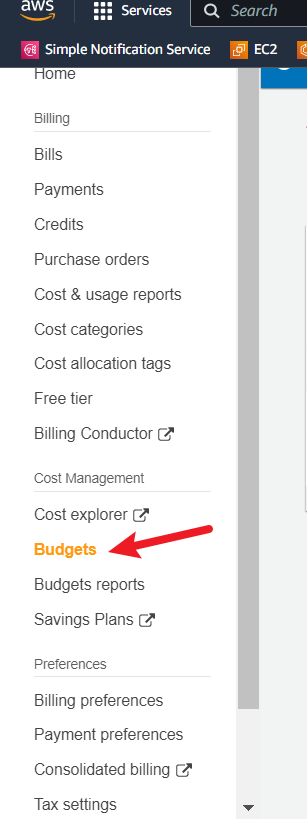
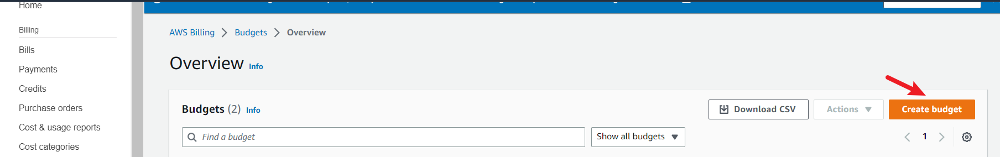
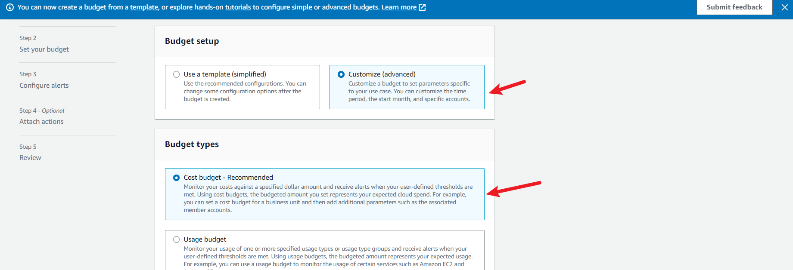

# Billing, Architecture, Security

##  Destroy your root account credentials, Set MFA, 

## Create an IAM user
- Sign in to the AWS Management Console with your root account credentials.
Navigate to the IAM service console.
- Click on the "Users" link in the left-hand menu and then click the "Add user" button.
- Enter a name for the user in the "User name" field.
- Select the "Programmatic access" and/or "AWS Management Console access" checkboxes to grant the user access to AWS resources via the AWS CLI, SDKs, or the AWS Management Console.
- If you select "AWS Management Console access", choose whether to create a custom password or allow the user to create their own password.
- Click "Next: Permissions".
- In the "Set permissions" step, you want to grant budget and cost alert permissions.
- Click on the "Permissions" tab and click the "Attach policies" button.
- In the search bar, search for "AWSBudgetsFullAccess" policy and select it.
- Click on "Attach policy".
The "AWSBudgetsFullAccess" policy grants the user full access to create, edit and delete budgets and also to receive budget notifications.
- Click "Next: Tags" to add tags to the user (optional).
- Click "Next: Review" to review your settings, and then click "Create user" to create the IAM user.

# To activate IAM user and role access to the Billing and Cost Management console
- Sign in to the AWS Management Console with your root user credentials (specifically, the email address and password that you used to create your AWS account).

- On the navigation bar, choose your account name, and then choose Account.

- Next to IAM User and Role Access to Billing Information, choose Edit.

- Select the Activate IAM Access check box to activate access to the Billing and Cost Management console pages.

- Choose Update.

[Read the AWS Official Documentations](https://docs.aws.amazon.com/IAM/latest/UserGuide/tutorial_billing.html?icmpid=docs_iam_console#tutorial-billing-step1)

# MFA
Multifactor authentication (MFA) is a security technology that requires multiple methods of authentication from independent categories of credentials to verify a user's identity for a login or other transaction.
Never, ever, use your root account for everyday use. Instead, head to [Identity and Access Management (IAM)](https://youtu.be/OdUnNuKylHg?t=967) and create an administrator user. 

- Protect and lock your root credentials in a secure place 
You will absolutely want to activate Multi Factor Authentication (MFA) too for your root account. And you won’t use this user unless strictly necessary.

- Now, about your newly created admin account, activating MFA for it is a must. It’s actually a requirement for every user in your account if you want to have a security first mindset.

-  Now we set up MFA for the [user](https://docs.aws.amazon.com/IAM/latest/UserGuide/id_credentials_mfa_enable_virtual.html)

- we can login into our IAM user after inputing the MFA code 

## Seting up AWS Budgets & Billing Alarms

AWS Budgets is a service that enables you to set custom cost and usage budgets that notify you when you exceed or are forecasted to exceed your budgeted amount. With AWS Budgets, you can track your service usage and your expenses, so you can optimize your costs and adjust your usage when necessary. You can create budgets for specific services or resource groups, set custom alerts, and receive notifications via email or SMS.

We are gonna create 2 budget one for AWS credits and the other  for actual dollar spend

- Go to billing 

- click on budget and create budget

## Use EventBridge to hookup Health Dashboard to SNS and send notification when there is a service health issue.

EventBridge is a serverless service that uses events to connect application components together, making it easier for you to build scalable event-driven applications.
Use it to route events from sources such as home-grown applications, AWS services, and third- party software to consumer applications across your organization.
EventBridge provides a simple and consistent way to ingest, filter, transform, and deliver events so you can build new applications quickly. 
##  Create an architectural diagram (to the best of your ability) the CI/CD logical pipeline in Lucid Charts

- I was able to set up a billing alarm
- I was able to set up aws budget 
- I destroyed my root account credentials and was able to Set MFA & IAM role

- Review all the questions of each pillars in the Well Architected Tool (No specialized lens)

- 