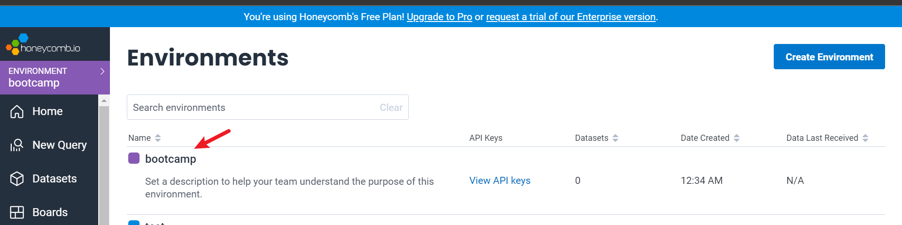

# Week 2 — Distributed Tracing

- Honey comb
## HoneyComb

- Go to ui.honeycomb.io create an account and create an environment


When creating a new dataset in Honeycomb it will provide all these installation insturctions


We'll add the following files to our `requirements.txt`

```
opentelemetry-api 
opentelemetry-sdk 
opentelemetry-exporter-otlp-proto-http 
opentelemetry-instrumentation-flask 
opentelemetry-instrumentation-requests
```

We'll install these dependencies:

```sh
pip install -r requirements.txt
```
- Add to the `app.py`

```py
from opentelemetry import trace
from opentelemetry.instrumentation.flask import FlaskInstrumentor
from opentelemetry.instrumentation.requests import RequestsInstrumentor
from opentelemetry.exporter.otlp.proto.http.trace_exporter import OTLPSpanExporter
from opentelemetry.sdk.trace import TracerProvider
from opentelemetry.sdk.trace.export import BatchSpanProcessor
```


```py
# Initialize tracing and an exporter that can send data to Honeycomb
provider = TracerProvider()
processor = BatchSpanProcessor(OTLPSpanExporter())
provider.add_span_processor(processor)
trace.set_tracer_provider(provider)
tracer = trace.get_tracer(__name__)
```

```py
# Initialize automatic instrumentation with Flask
app = Flask(__name__)
FlaskInstrumentor().instrument_app(app)
RequestsInstrumentor().instrument()
```

Add the following Env Vars to `backend-flask` in docker compose

```yml
OTEL_EXPORTER_OTLP_ENDPOINT: "https://api.honeycomb.io"
OTEL_EXPORTER_OTLP_HEADERS: "x-honeycomb-team=${HONEYCOMB_API_KEY}"
OTEL_SERVICE_NAME: "${HONEYCOMB_SERVICE_NAME}"
```

- You'll need to grab the API key from your honeycomb account:



```sh
export HONEYCOMB_API_KEY=""
export HONEYCOMB_SERVICE_NAME="Cruddur"
gp env HONEYCOMB_API_KEY=""
gp env HONEYCOMB_SERVICE_NAME="Cruddur"
```
- Run  `docker compose up`

- Get the backend url from the port tab and add `/api/activities/home` to the back and refresh the page like 3 times, you should get a result on your honeycomb site


## X-Ray 

AWS X-Ray helps developers analyze and debug production, distributed applications, such as those built using a microservices architecture. With X-Ray, you can understand how your application and its underlying services are performing to identify and troubleshoot the root cause of performance issues and errors.


- After going through the [aws-xray-sdk-python](https://github.com/aws/aws-xray-sdk-python)

Add to the `requirements.txt`

```py
aws-xray-sdk
```

Install pythonpendencies

```sh
pip install -r requirements.txt
```

Add to `app.py`

```py
from aws_xray_sdk.core import xray_recorder
from aws_xray_sdk.ext.flask.middleware import XRayMiddleware

xray_url = os.getenv("AWS_XRAY_URL")
xray_recorder.configure(service='Cruddur', dynamic_naming=xray_url)
XRayMiddleware(app, xray_recorder)
```

### Setup AWS X-Ray Resources

Add `aws/json/xray.json`

```json
{
  "SamplingRule": {
      "RuleName": "Cruddur",
      "ResourceARN": "*",
      "Priority": 9000,
      "FixedRate": 0.1,
      "ReservoirSize": 5,
      "ServiceName": "Cruddur",
      "ServiceType": "*",
      "Host": "*",
      "HTTPMethod": "*",
      "URLPath": "*",
      "Version": 1
  }
}
```


Paste in the terminal
```sh
aws xray create-group \
   --group-name "Cruddur" \
   --filter-expression "service(\"backend-flask\")"
```
- check the aws console for result:


```sh
aws xray create-sampling-rule --cli-input-json file://aws/json/xray.json
```
- check the aws console for result:


### Add Deamon Service to Docker Compose
We need to add these two env vars to our backend-flask in our `docker-compose.yml` file
```yml
  xray-daemon:
    image: "amazon/aws-xray-daemon"
    environment:
      AWS_ACCESS_KEY_ID: "${AWS_ACCESS_KEY_ID}"
      AWS_SECRET_ACCESS_KEY: "${AWS_SECRET_ACCESS_KEY}"
      AWS_REGION: "us-east-1"
    command:
      - "xray -o -b xray-daemon:2000"
    ports:
      - 2000:2000/udp
```


```yml
      AWS_XRAY_URL: "*4567-${GITPOD_WORKSPACE_ID}.${GITPOD_WORKSPACE_CLUSTER_HOST}*"
      AWS_XRAY_DAEMON_ADDRESS: "xray-daemon:2000"
```
## XRAY SUB_SEGMENTS
- after uncommenting xray codes in the app.py

- in the user_activities.py 
 we added xray subsegments mock data code 
- The result


> Looks like this:


> Refrences:
 [Install X-ray Daemon](https://docs.aws.amazon.com/xray/latest/devguide/xray-daemon.html)

[Github aws-xray-daemon](https://github.com/aws/aws-xray-daemon)
[X-Ray Docker Compose example](https://github.com/marjamis/xray/blob/master/docker-compose.yml)


- Run:
`Docker compose up`


- Get the url from the port tab and add `/api/activities/home` to the back and enter


- check the xray containers log


- on the AWS console


## CloudWatch Logs


- Add to the `requirements.txt`

```
watchtower
```
- run: 
```sh
pip install -r requirements.txt
```


- In `app.py`
add:
```
import watchtower
import logging
from time import strftime
```

```py
# Configuring Logger to Use CloudWatch
LOGGER = logging.getLogger(__name__)
LOGGER.setLevel(logging.DEBUG)
console_handler = logging.StreamHandler()
cw_handler = watchtower.CloudWatchLogHandler(log_group='cruddur')
LOGGER.addHandler(console_handler)
LOGGER.addHandler(cw_handler)
LOGGER.info("some message")
```

```py
@app.after_request
def after_request(response):
    timestamp = strftime('[%Y-%b-%d %H:%M]')
    LOGGER.error('%s %s %s %s %s %s', timestamp, request.remote_addr, request.method, request.scheme, request.full_path, response.status)
    return response
```

- We'll log something in an API endpoint
```py
LOGGER.info('test log')
```

- set the env var in your backend-flask for `docker-compose.yml`

```yml
      AWS_DEFAULT_REGION: "${AWS_DEFAULT_REGION}"
      AWS_ACCESS_KEY_ID: "${AWS_ACCESS_KEY_ID}"
      AWS_SECRET_ACCESS_KEY: "${AWS_SECRET_ACCESS_KEY}"
```

- get the port address of the backend and add `/api/activities/home` to it back and refresh


- check the cloudwatch console


## Rollbar 


## Rollbar

- Go to and sign up https://rollbar.com/

- Create a new project in Rollbar called `Cruddur`
- get the ROLLBAR ACCESS TOKEN


- Add to `requirements.txt`


```
blinker
rollbar
```

- Install what is in the requirements.txt

```sh
pip install -r requirements.txt
```

We need to set our access token

```sh
export ROLLBAR_ACCESS_TOKEN=""
gp env ROLLBAR_ACCESS_TOKEN=""
```

Add to backend-flask for `docker-compose.yml`

```yml
ROLLBAR_ACCESS_TOKEN: "${ROLLBAR_ACCESS_TOKEN}"
```

Import for Rollbar

```py
import rollbar
import rollbar.contrib.flask
from flask import got_request_exception
```

```py
rollbar_access_token = os.getenv('ROLLBAR_ACCESS_TOKEN')
@app.before_first_request
def init_rollbar():
    """init rollbar module"""
    rollbar.init(
        # access token
        rollbar_access_token,
        # environment name
        'production',
        # server root directory, makes tracebacks prettier
        root=os.path.dirname(os.path.realpath(__file__)),
        # flask already sets up logging
        allow_logging_basic_config=False)

    # send exceptions from `app` to rollbar, using flask's signal system.
    got_request_exception.connect(rollbar.contrib.flask.report_exception, app)
```

We'll add an endpoint just for testing rollbar to `app.py`

```py
@app.route('/rollbar/test')
def rollbar_test():
    rollbar.report_message('Hello World!', 'warning')
    return "Hello World!"
```


[Rollbar Flask Example](https://github.com/rollbar/rollbar-flask-example/blob/master/hello.py)

